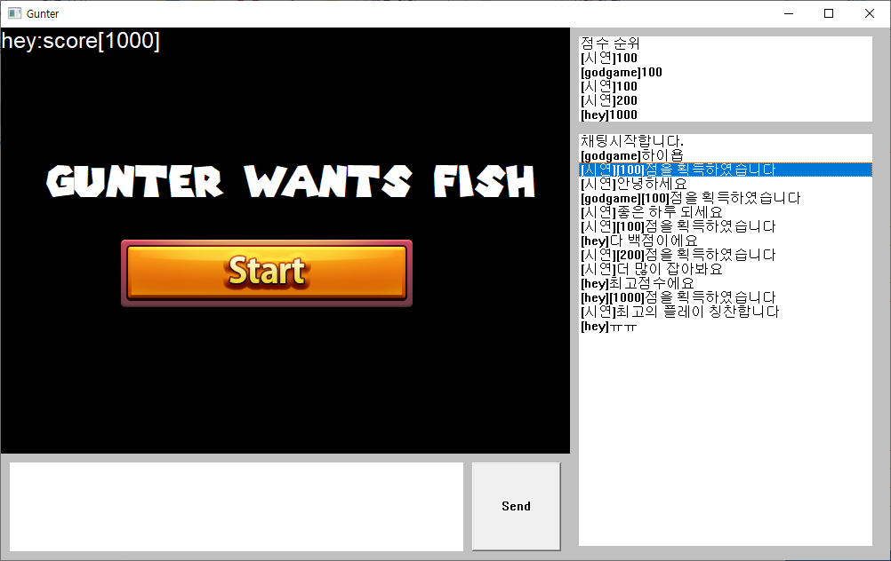

# WinAPI를 이용한 2D게임 제작


## 1. 게임 소개
- 제목
  + 하늘에서 마리오가 내려와
- 제작 기간 
  + 2019. ~ 
  + 1인 프로젝트
  + VisualC++, WinAPI 이용
- 컨셉
  + 제한된 공간에서 적을 피하며 처치. 더 많은 적을 처치한 플레이어가 승리
- 게임 종류
  + 2인용 캐주얼 플랫폼 게임(합 앤 밤) – 버블버블, 슈퍼마리오 참고
- 패배 조건
  + 적과 충돌
- 재미 요소 
  + 적이 비정기적으로 점프를 하도록 하여 난이도와 스릴 UP
- 키
  + 이동 : 방향키
  + 프레임 확인 : 스페이스바
  
## 2. 구현 내용
[게임 엔진]
- 충돌 시스템 : 플랫폼과 게임캐릭터간의 충돌
- 중력 : 공중에 있을 시 아래로 추락, 점프 시 포물선 운동
- 소리 : Fmod 라이브러리 이용. 배경음악 및 효과음
- 스프라이트 : 게임캐릭터들의 상태에 따라 스프라이트 바뀜
- FSM : Move, Stand, Attack, Dead
- UI - 이벤트에 따라 SCENE 전환
- 글꼴 : AddFontResource() 사용하여 기본 글꼴 바꿈
- 유저 입력 : 마우스, 키보드

[네트워크]
- 채팅 프로그램 제작
- Winsock의 TCP 프로토콜 제작
- EventSelect 모델 사용하여 서버와 클라이언트 제작

[WinAPI]
- 채팅 창 및 점수 창 구현
## 3. 클래스 구성
### 3.1 전체적 흐름


- sample - 메인 함수(Init - Frame - Render -Release)
  - 각 클래스들은 Init에서 필요한 정보 생성 및 로드, 할당
  - Frame에서 필요한 계산
  - Render를 통해 화면에 뿌려진다. 
  - 모든 작업이 완료된 뒤에는 Release를 통해 할당 해제한다.
- Clientsample - 채팅, WinAPI 창띄우기 담당
- GameScene - 게임 씬 담당

### 3.2 syLib
[syLib](https://github.com/siyeon-lee/GunterChat/tree/master/syLib"syLib")
게임 구동하는 엔진 라이브러리

#### 3.2.1. sywindow, sycore 클래스

 - syWindow
  - 윈도우를 생성한다
  - 윈도우 인스턴스 핸들, 윈도우 핸들, Client 크기 
- syCore
  - 게임의 기본 흐름을 관장하는 core를 생성한다.

#### 3.2.2. 클래스 매니저들

- Singleton Pattern 사용
  - 전담 매니저 사용
  - 리소스를 전담 매니저 통해 불러 코드 어디서든 사용 가능하게
  - 리소스 중복 호출을 방지
+ syInput : 마우스, 키보드 등 유저 입력 관리
+ syBitmapMgr : 비트맵 파일 리소스 관리
+ syFSM 
+ syScriptManager : 필요한 리소스 스크립트화 하여 관리
+ sySoundMgr

#### 3.2.3. UI
 
 
 - 실행시 LoginScene(서버 연결) - Lobby Scene(게임시작준비/결과) - InGameScene(게임진행) 
 - 게임오버될경우 Lobby Scene으로 돌아감\
 
 
#### 3.2.4. 오브젝트 생성
 
- syCharacter
   - sprite클래스 상속
   - 비트맵 크기 조절, 중력, 발판과의 충돌 처리 구현
- syPlayer
  - 프레임마다 방향키 입력시 이동 구현
syEnemy
  - FSM 통해 움직임 구현 및 스프라이트 변경
syBackGround
  - tiled 이용.
  - 모든 배경을 tile화 하여 각각 비트맵 그려줌
    > cpu 점유율이 너무 높아짐
    >> 충돌 체크를 해야 하는 발판들만 tile로 구현 
    > cpu 점유율이 너무 높아서 충돌 체크를 해야 하는 발판들만 tile로 구현 
       
#### 3.2.5. FSM
 
- syEnemy의 m_ActionList에는 Move,~~Stand, Attack,~~ Dead가 할당되어 있음
- 기본 Stand 상태에서 특정 event가 발생할 때마다 Enemy(마리오)의 상태 전환
- Move
  - 
  - 적이 발판 위에 올라선 기본 상태
  - 무작위한 시간 간격으로 점프를 하며 항상 이동한다.
- Dead
  - 
  - 공격을 받은 적의 상태
  - 특정 적이 DEAD STATE가 되면 3초 뒤 제거, 5초 뒤 리스폰한다.
  
#### 3.2.6. 플레이어


- 키 입력 상태에 따라 정지/이동/점프
  
#### 3.2.7. 기타
- syPoint, sySphere, syRect
   - 충돌 영역, 캐릭터의 위치, 그려지는 영역 등 지정


### 3.3 네트워크
- ClientSample 클래스
- Event Select 모델 이용

- PacketProcess()
  >RecvPool에 담긴 패킷을 읽어서 패킷 헤더 타입에 따라 알맞게 처리한다.
- m_Network.Frame() 
  > 접속 여부를 판단하고 접속 실패시 재접속 혹은 클라이언트를 닫는다
  > RSet WSet에 소켓을 넣어준다.

#### 3.3.1. 프로토콜
```C++
//위치, 점수, 채팅메세지 통보
#define PACKET_CHAR_MSG			 1000 
//유저 확인 요청
#define PACKET_CHAR_NAME_SC_REQ  1001
//유저 확인 통보
#define PACKET_CHAR_NAME_CS_ACK  1002 
//접속 허가
#define PACKET_JOIN_SIGNIN_SC	 1003 
//접속 요청
#define PACKET_JOIN_USER_SC		 1004 
//종료 요청
#define PACKET_DRUP_CS_REQ		 1005 
//종료 허가
#define PACKET_DRUP_SC_ACK		 1006 
//접속 해제
#define PACKET_DRUP_USERS_SC	1007 
//점수 통보
#define PACKET_RESULT_CS		1008	
//점수 통보
#define PACKET_RESULT_SC		1009
```
#### 3.3.2. 시퀀스 다이어그램
 
 
 
 
 
 
 - GameScene 클래스에서 이벤트에 따라 씬 전환
 - ClientSample 클래스에서 RecvPool에 있는 패킷의 프로토콜 타입에 따라 채팅 관리
  
### 3.4 Window API

  - 4개의 차일드 윈도우
  - editBox통해 채팅 입력받고 전송
    > 엔터키 활성화 위해 서브클래싱 사용
    ```C++
    old_edit_proc = (WNDPROC)SetWindowLongPtr(m_hEdit, GWLP_WNDPROC, (LONG_PTR)myEditProc);
    ```
  - 서버에서 받은 메세지 및 점수 순위 listbox에 띄움


## 4. 기타
 
 - tiled 프로그램으로 맵 제작
